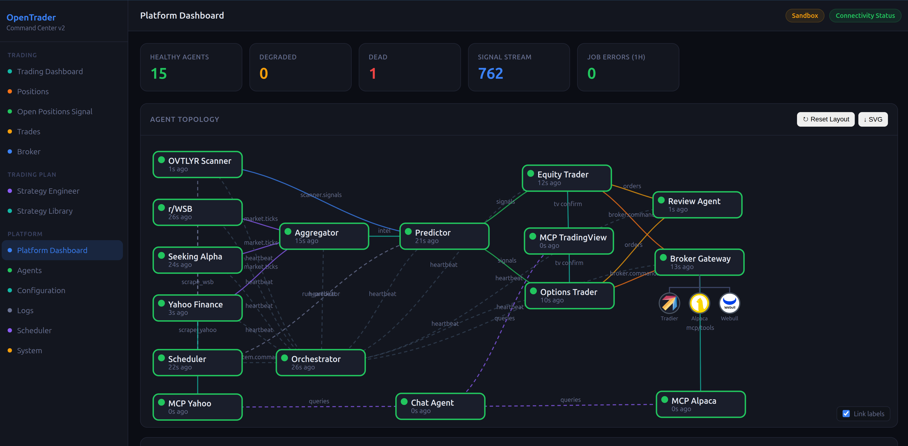

# OpenTrader

An AI-driven algorithmic trading platform built on a microservices architecture using Podman, Redis, and TimescaleDB. Supports multiple brokers (Tradier, Alpaca, Webull) with a real-time web dashboard, LLM-powered signals, and automated trade execution.



---

## Features

- **Multi-broker support** — Tradier, Alpaca, and Webull (paper + live accounts)
- **AI-powered signals** — LLM predictor via OpenRouter (Claude, GPT-4o, and more)
- **Real-time WebUI** — Dark-themed SPA dashboard with live WebSocket updates
- **Strategy Engineer** — AI-assisted strategy builder with version control and backtesting
- **Scheduler** — Market-hours-aware job runner with DB-persisted configuration
- **Notifications** — Telegram, Discord, and AgentMail alerts
- **EOD review** — Automated end-of-day trade analysis and recommendations
- **Self-healing** — Orchestrator watchdog with circuit breaker and auto-restart

---

## Architecture

```
┌─────────────────────────────────────────────────────┐
│                   WebUI (port 8080)                 │
│         FastAPI + WebSocket + Static SPA            │
└───────────────────┬─────────────────────────────────┘
                    │ Redis Streams / Pub-Sub
    ┌───────────────┼───────────────────────┐
    │               │                       │
┌───▼────┐   ┌──────▼──────┐   ┌───────────▼──────┐
│Scheduler│   │Orchestrator │   │  Broker Gateway  │
│APScheduler  │ Watchdog    │   │Tradier/Alpaca/    │
│+DB jobs│   │ Circuit Bkr │   │Webull connectors  │
└────────┘   └─────────────┘   └──────────────────┘
    │
┌───▼──────────────────────────────────────────────┐
│  Agents: Predictor · Traders · Scrapers · Review  │
└───────────────────────────────────────────────────┘
    │
┌───▼─────────────────┐   ┌──────────────────────────┐
│  Redis 7            │   │  TimescaleDB (pg16)       │
│  Streams, pub/sub   │   │  trades, signals,         │
│  job cache          │   │  sentiment, scheduler_jobs│
└─────────────────────┘   └──────────────────────────┘
```

---

## Services

| Container | Description | Port |
|---|---|---|
| `ot-webui` | Command Center dashboard | 8080 |
| `ot-orchestrator` | Watchdog + circuit breaker | — |
| `ot-scheduler` | APScheduler job runner | — |
| `ot-predictor` | LLM signal generator | — |
| `ot-trader-equity` | Equity order executor | — |
| `ot-trader-options` | Options order executor | — |
| `ot-broker-gateway` | Multi-broker router | — |
| `ot-scraper-ovtlyr` | OVTLYR market scanner | — |
| `ot-scraper-wsb` | Reddit WSB sentiment | — |
| `ot-scraper-seekalpha` | SeekAlpha news scraper | — |
| `ot-scraper-yahoo` | Yahoo Finance data | — |
| `ot-aggregator` | Signal aggregator | — |
| `ot-review-agent` | EOD trade review | — |
| `ot-chat-agent` | Telegram/Discord bot | — |
| `ot-mcp-yahoo` | Yahoo Finance MCP server | — |
| `ot-mcp-alpaca` | Alpaca MCP server | — |
| `ot-mcp-tradingview` | TradingView MCP server | — |
| `ot-redis` | Redis 7 | — |
| `ot-timescaledb` | TimescaleDB pg16 | — |
| `ot-grafana` | Metrics dashboard | 3000 |

---

## Quick Start

### Prerequisites
- Podman 4.0+ and podman-compose 1.0+
- Linux (tested on Ubuntu 24+)

### Setup

```bash
git clone https://github.com/euriska/opentrader.git
cd opentrader
git submodule update --init --recursive

# Configure credentials
cp .env.sample .env
nano .env  # fill in your API keys

# Configure broker accounts
cp config/accounts.toml.sample config/accounts.toml
# accounts.toml uses ${ENV_VAR} references — set vars in .env

# Build and start
podman-compose up -d

# Open dashboard
open http://localhost:8080
```

---

## Configuration

### `.env` — Required keys

| Variable | Description |
|---|---|
| `OPENROUTER_API_KEY` | LLM provider — get at openrouter.ai |
| `WEBUI_TOKEN` | Dashboard auth token (any string) |
| `DB_PASSWORD` | TimescaleDB password |
| `TRADIER_SANDBOX_API_KEY` | Tradier paper trading key |
| `TRADIER_PRODUCTION_API_KEY` | Tradier live trading key |
| `ALPACA_API_KEY` | Alpaca paper API key |
| `ALPACA_API_SECRET` | Alpaca paper API secret |
| `ALPACA_LIVE_API_KEY` | Alpaca live API key |
| `ALPACA_LIVE_API_SECRET` | Alpaca live API secret |
| `WEBULL_API_KEY` | Webull API key |
| `WEBULL_SECRET_KEY` | Webull secret key |
| `TELEGRAM_BOT_TOKEN` | Telegram bot token (optional) |
| `DISCORD_WEBHOOK_URL` | Discord webhook (optional) |
| `AGENTMAIL_API_KEY` | AgentMail key for email reports (optional) |
| `OVTLYR_EMAIL` / `OVTLYR_PASSWORD` | OVTLYR credentials (optional) |

See `.env.sample` for the full list.

### Broker accounts — `config/accounts.toml`

Copy from `config/accounts.toml.sample`. All account IDs reference `${ENV_VAR}` so no credentials are stored in the file itself.

---

## WebUI Sections

| Section | Description |
|---|---|
| Overview | Market clock, agent health, live signal feed |
| Agents | Per-container CPU/mem/uptime, log viewer, restart |
| Scheduler | Job manager — create, edit, enable/disable, run now |
| Trades | P&L summary and fill history per account |
| Signals | Signal table with ticker, direction, confidence |
| Sentiment | WSB/news sentiment scores |
| Logs | Live container log viewer |
| System | Circuit breaker, halt/resume, container table |
| Strategy Engineer | AI-assisted strategy builder with version control |
| Brokers | Broker credential configuration |

---

## Supported Brokers

| Broker | Paper | Live | Notes |
|---|---|---|---|
| Tradier | ✅ | ✅ | Equities + options |
| Alpaca | ✅ | ✅ | Equities, crypto |
| Webull | ✅ | ✅ | Equities, options |

---

## License

MIT
